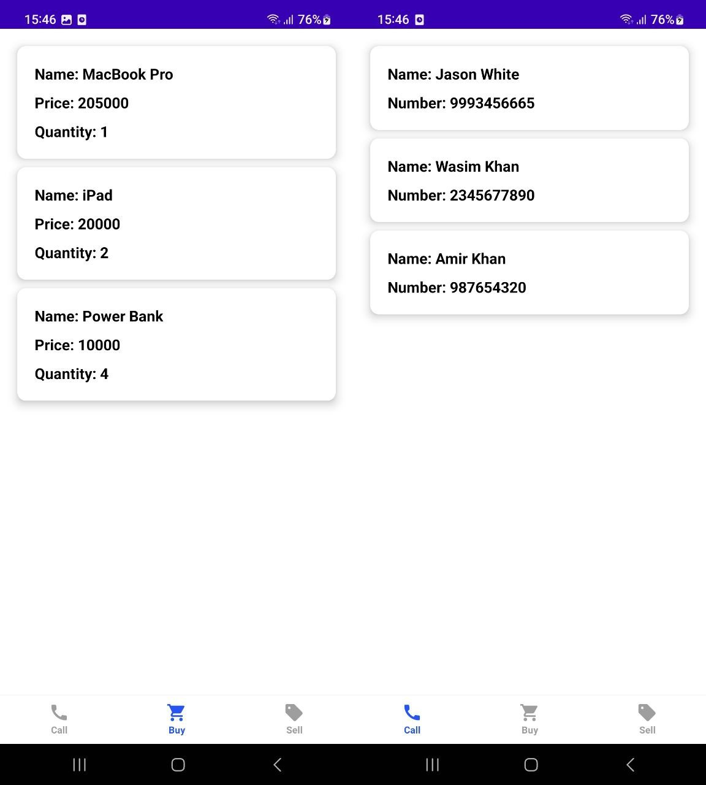

# To Do App

**To Do App** is a fully functional Android app built entirely with Kotlin and Jetpack Compose. It
follows Android design and development best practices and is intended to be a useful reference
for developers.

This app is an assignment for interviewer at Joblogic. You can read assignment [here](docs/Todo_App_for_Interview_2022.pdf).

# Features

**To Do App** is a simple app which displays sample data from network and database on UI.

# Screenshots

# Architecture

The **To Do App** app follows the
[official architecture guidance](https://developer.android.com/topic/architecture)
and [Now in Android app](https://github.com/android/nowinandroid)

# Modularization

The **To Do App** app has been fully modularized and you can find the detailed guidance and
description of the modularization strategy used in
[modularization learning journey](https://github.com/android/nowinandroid/blob/main/docs/ModularizationLearningJourney.md).